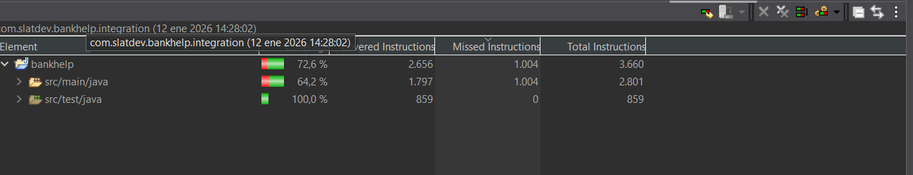

# BankHelp – Sistema de Soporte Bancario con Arquitectura Limpia

API RESTful para gestión de tickets de soporte en una entidad bancaria.  
Desarrollado con **Clean Architecture + influencias de Arquitectura Hexagonal** y conceptos de **DDD táctico** (entidades con comportamiento, agregados básicos, excepciones expresivas del dominio).


### Características principales
- Registro y autenticación de usuarios (CLIENT / AGENT) con **JWT + refresh tokens**
- Creación y consulta de tickets de soporte
- Revocación de refresh tokens al logout
- Manejo de excepciones granular (separación entre validaciones de input y reglas de negocio)
- Tests unitarios (slices) + integración con Testcontainers + PostgreSQL real
- Configuraciones inyectadas como puertos para facilitar testabilidad

### Tecnologías
- **Backend**: Java 17, Spring Boot 3.2+, Spring Security, Spring Data JPA
- **Seguridad**: JWT (acceso + refresh), BCrypt, roles (CLIENT / AGENT)
- **Base de datos**: PostgreSQL 15 (con Docker Compose)
- **Testing**: JUnit 5, Mockito, Testcontainers, MockMvc
- **Arquitectura**: Clean Architecture + Hexagonal (dependencias hacia adentro)

### Estructura del proyecto (Clean Architecture)

Aquí se aprecia la separación clara de responsabilidades:
```
src/main/java/com/slatdev/bankhelp
├── domain                     ← corazón del negocio (entidades, reglas, puertos)
│   ├── exception
│   │   ├── validation/     ← validaciones de datos (400/422)
│   │   └── rules/          ← invariantes y reglas de negocio (422)
│   ├── model
│   └── repository          ← puertos (interfaces)
├── application                ← casos de uso + servicios + configs como puertos
│   ├── config              ← puertos de configuración (token durations, etc.)
│   ├── exception           ← excepciones técnicas y de aplicación
│   ├── usecase
|   └── service
└── infrastructure             ← adaptadores (JPA, controllers, security filters)
    ├── exception           ← handler global
    ├── persistence         ← JPA entities + adapters
    ├── security
    └── web                 ← controllers + DTOs
```
### Instalación y ejecución rápida

```bash
# 1. Levantar PostgreSQL
docker-compose up -d

# 2. Compilar y ejecutar
./mvnw clean install
./mvnw spring-boot:run
```
### Endpoints principales
| Método |      Endpoint      |           Descripción          | Auth requerida |
|:------:|:------------------:|:------------------------------:|:--------------:|
| POST   | /api/auth/register | Registro de usuario            | No             |
| POST   | /api/auth/login    | Login → access + refresh token | No             |
| POST   | /api/auth/refresh  | Refrescar access token         | Refresh token  |
| POST   | /api/auth/logout   | Revocar refresh token          | Refresh token  |
| POST   | /api/tickets       | Crear ticket                   | JWT            |
| GET    | /api/tickets       | Listar todos (solo AGENT)      | JWT            |
| GET    | /api/tickets/mine  | Mis tickets                    | JWT            |

### Próximos pasos / ideas de ampliación
  - Añadir Swagger/OpenAPI
  - Roles más granulares + permisos por acción
  - Frontend básico (React/Vue/Angular) consumiendo la API
  - Rate limiting + auditoría de tickets
  - CI/CD con GitHub Actions
### ¿Por qué este proyecto?
Proyecto diseñado para demostrar comprensión real de conceptos clave en desarrollo backend:

- Clean Architecture + Arquitectura Hexagonal (dependencias estrictamente controladas) + DDD táctico ligero  
- Seguridad moderna y completa con JWT (access token + refresh token + revocación explícita)  
- Manejo de excepciones expresivo y mantenible (separación clara entre validaciones de input y reglas de negocio)  
- Testing de calidad (slices de controladores + integración end-to-end con Testcontainers y PostgreSQL real)

El foco está en calidad de código, escalabilidad y buenas prácticas, más que en cantidad de funcionalidades.
### Decisiones arquitectónicas destacadas
- **Domain aislado**  
  Entidades con comportamiento (`resolve()` en Ticket) y excepciones expresivas del dominio.

- **Validaciones separadas**  
  `DomainInputException` (datos mal formados) vs `DomainRuleException` (invariantes rotos)

- **NotFound y errores técnicos**  
  En capa de aplicación (no contaminan el dominio)

- **Configs como puertos**  
  `AccesTokenProperties` y `RefreshTokenProperties` en application para evitar dependencias inversas

- **Testing sólido**  
  Slices de controladores + integración end-to-end con Testcontainers y PostgreSQL real.  
  Cobertura global del **72.6%** (con un 100% de cobertura en la capa de tests).

  <p align="center">
    
    <br>
    <em>Cobertura (12 ene 2026): 72.6% global, 100% en tests</em>
  </p>
### Licencia
MIT License
### Contacto
- Johan Sebastian Salvatierra Gutierrez
- [LinkedIn](https://www.linkedin.com/in/johansalgut/)
